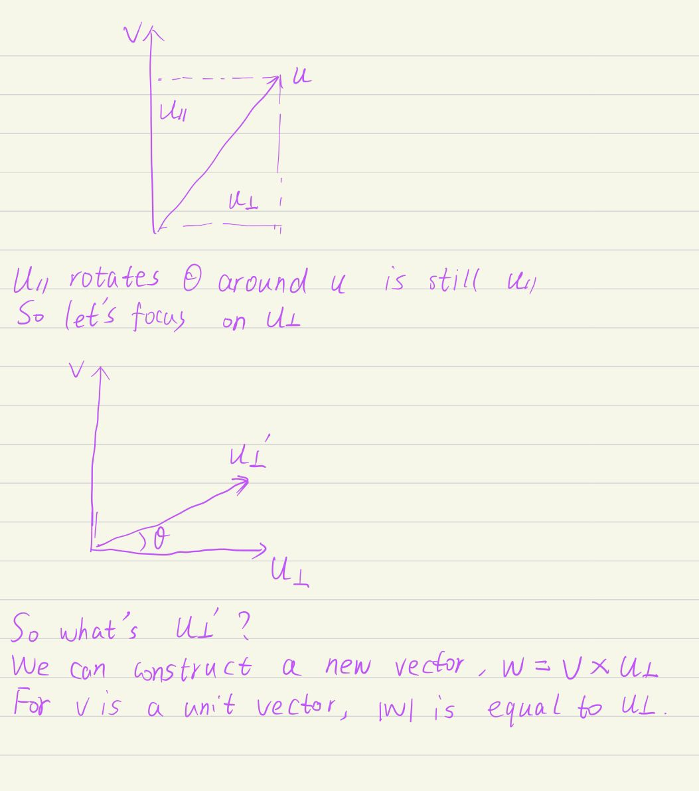
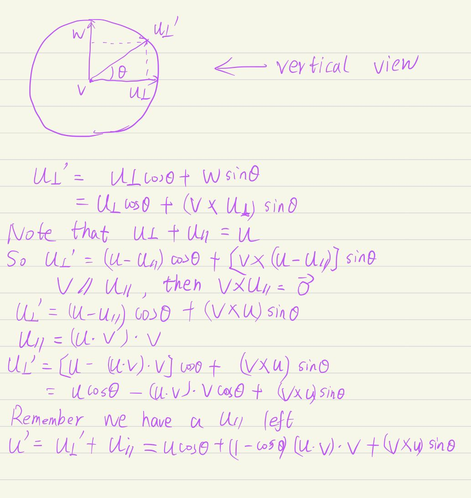

# Assignment1

## 1. assignment

- Contruct the model matrix correctly.
- Construct the perspective projection matrix correctly.
- Construct a function in main.cpp, the function of it is to get the rotation transformation matrix around any axis passing through the origin. 

## 2. code analysis

Before coding, I think we should analyze these codes. We should have a certain understanding of the whole framework.

### 2.1 Triangle

#### 2.1.1 constructor

This is to do some initial work. If you don't know the texture, it is ok! We will meet it again in later classes.

#### 2.1.2 setVertex&&setNormal&&setColor

People as they are...

#### 2.1.3 setTexCoord

Set texture coordinates. It doesn't matter if you don't know.

#### 2.1.4 toVector4(important)

Convert the vertices of the triangle to homogeneous coordinates.

### 2.2 rasterizer

#### 2.2.1 Buffers

You can ignore it temporarily.

#### 2.2.2 rasterizer

Only a few important functions are discussed here.

##### 2.2.2.1 to_vec4

Convert the vertices of the triangle to homogeneous coordinates.

##### 2.2.2.2 clear

This function will initialize frame_buf and depth_buf.

Note that frame_buf is initialized to (0,0,0)(black) and depth_buf is initialized to infinity.

We will use them in later classes.

##### 2.2.2.3 draw_line

Bresenham's line drawing algorithm. If you are interested in it, you can find relevant information. If not, it doesn't matter.

##### 2.2.2.4 draw

First, buf and ind respectively take out the triangle coordinates and index previously loaded into the rasterizer. F1 and f2 are used to stretch the z-axis from the standard cube (-1,1) to (0,100) (though I don't know why).

 In short, multiply the mvp transformation matrix by the coordinates of the three vertices of the triangle, and finally transform the triangle into a standard cube of [-1,1]^3. Then through the viewport transformation, the x direction is changed from [-1,1] to [0,width], the y direction is changed from [-1,1] to [0,height], and the z direction is changed from [-1,1] to around [0,100]. 

## 3. coding

### 3.1 get_model_matrix

Create the model matrix for rotating the triangle around the Z axis. Very simple.

```cpp
Eigen::Matrix4f get_model_matrix(float rotation_angle)
{
    Eigen::Matrix4f model = Eigen::Matrix4f::Identity();

    // TODO: Implement this function
    // Create the model matrix for rotating the triangle around the Z axis.
    // Then return it.

    // radian system
    double theta = rotation_angle / 180.0 * MY_PI;
    double cos_theta = std::cos(theta);
    double sin_theta = std::sin(theta);

    // transformation matrix
    model << cos_theta, -sin_theta, 0, 0,
             sin_theta, cos_theta, 0, 0,
             0, 0, 1, 0,
             0, 0, 0, 1;

    return model;
}
```

### 3.2 get_projection_matrix

```cpp
Eigen::Matrix4f get_projection_matrix(float eye_fov, float aspect_ratio,
                                      float zNear, float zFar)
{
    // Students will implement this function

    Eigen::Matrix4f projection = Eigen::Matrix4f::Identity();

    // TODO: Implement this function
    // Create the projection matrix for the given parameters.
    // Then return it.

    // radian system
    double eye_fov_theta = eye_fov / 180.0 * std::acos(-1);
    double A = zNear + zFar;
    double B = - zNear * zFar;
    // persp -> ortho
    Matrix4f persp2ortho;
    persp2ortho << zNear, 0, 0, 0,
                  0, zNear, 0, 0,
                  0, 0, A, B,
                  0, 0, 1, 0;

    // some parameters
    double t = -zNear * std::cos(eye_fov_theta / 2);
    double r = t * aspect_ratio;
    double b = -t;
    double l = -r;

    // translate
    Matrix4f translate;
    translate << 1, 0, 0, -(r + l) / 2.0,
                 0, 1, 0, -(t + b) / 2.0,
                 0, 0, 1, -(zNear + zFar) / 2.0,
                 0, 0, 0, 1;
    // scale
    Matrix4f scale;
    scale << 2.0 / (r - l), 0, 0, 0,
             0, 2.0 / (t - b), 0, 0,
             0, 0, 2.0 / (zFar - zNear), 0,
             0, 0, 0, 1;

    projection = scale * translate * persp2ortho;

    return projection;
}
```

### 3.3 get_rotation(Rodrigues’ Rotation formula)

```cpp
// rotate by any axis
Eigen::Matrix4f get_rotation(Vector3f axis, float angle)
{
    Eigen::Matrix4f model = Eigen::Matrix4f::Identity();
    double theta = angle / 180.0 * MY_PI;
    double cos_theta = std::cos(theta);
    double sin_theta = std::sin(theta);

    Eigen::Matrix3f temp;
    temp << 0, -axis[2], axis[1],
            axis[2], 0, -axis[0],
            -axis[1], axis[0], 0;
    Eigen::Matrix3f trans;
    trans = cos_theta * Eigen::Matrix3f::Identity() + (1 - cos_theta) * axis * axis.adjoint() + sin_theta * temp;
    model << trans(0, 0), trans(0, 1), trans(0, 2), 0,
             trans(1, 0), trans(1, 1), trans(1, 2), 0,
             trans(2, 0), trans(2, 1), trans(2, 2), 0,
             0, 0, 0, 1;
    return model;
}
```


## 4. Rodrigues’ Rotation formula

I want to discuss this topic a little bit.

We have a unit vector $u$, and a vector $v$. If we want $u$ to rotate $\theta$ around $v$. 






