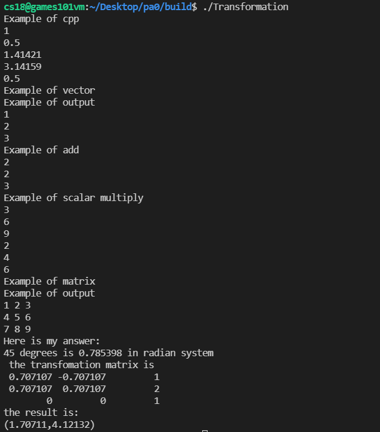

# Assignment0

## 1. configuration

...

## 2. assignment

Given a point P=(2,1), rotate the point counterclockwise 45° around the origin, and then translate (1,2) to calculate the coordinates of the transformed point (required to use homogeneous coordinates for calculation).

## 3. solution

```cpp
    // here is my code
    std::cout << "Here is my answer:" << std::endl;
    Eigen::Vector3f point(2.0f, 1.0f, 1.0f);
    Eigen::Matrix3f trans;
    // use some mathematical knowledge
    double theta = 45.0 / 180.0 * std::acos(-1);
    std::cout << "45 degrees is " << theta << " in radian system" << std::endl;
    double cos_theta = std::cos(theta);
    double sin_theta = std::sin(theta);

    trans << cos_theta, -sin_theta, 1.0f,
             sin_theta, cos_theta, 2.0f,
             0, 0, 1;
    std::cout << " the transfomation matrix is" << std::endl << trans << std::endl;
    Eigen::Vector3f result = trans * point;
    std::cout << "the result is:" << std::endl;
    std::cout << "(" << result[0] << "," << result[1] << ")" << std::endl;
```

## 4. run screenshot



